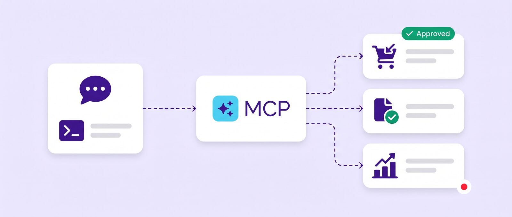
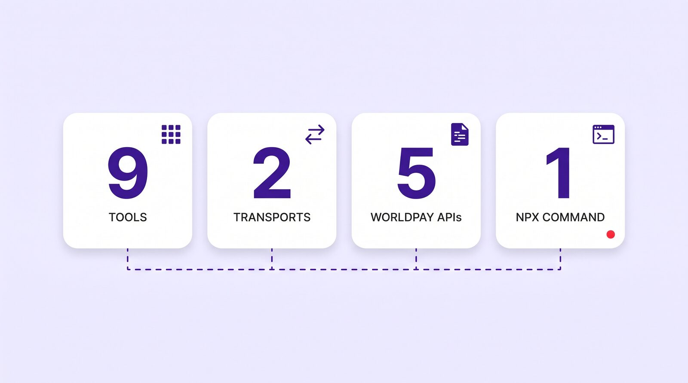
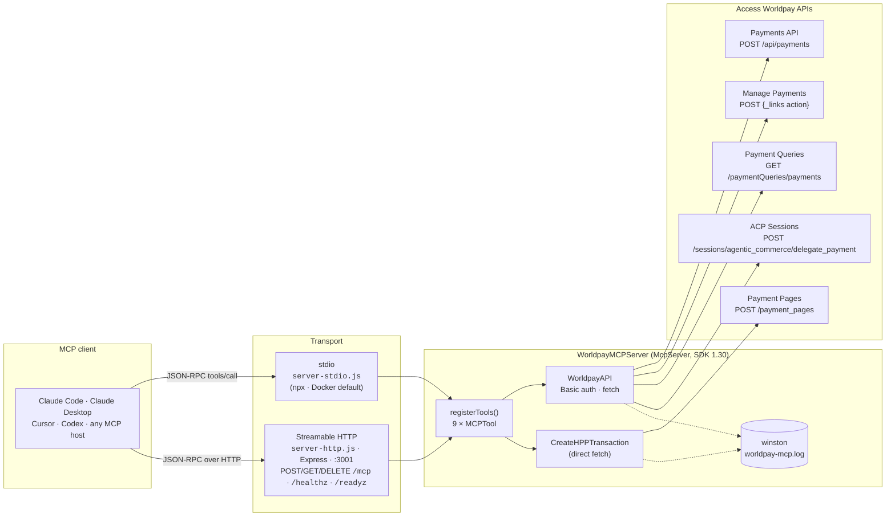
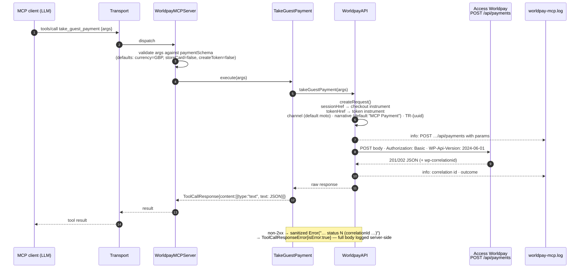
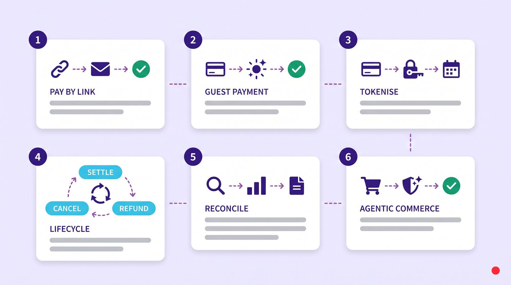

<!-- Hero -->
<p align="center">
  
</p>

<div align="center">

# Worldpay MCP Server

**A [Model Context Protocol](https://modelcontextprotocol.io/) server that lets AI agents and coding assistants take payments, manage them, create tokens, generate pay-by-link pages and query payment history through [Access Worldpay](https://developer.worldpay.com/) — nine tools, two transports, one `npx` command.**

[](https://www.npmjs.com/package/@worldpay/worldpay-mcp)
[](https://github.com/davendra/worldpay-mcp/actions/workflows/ci.yml)


[](LICENSE)

**[Quick start](#quick-start)** · [Connect your client](#connect-your-client) · [Architecture](docs/architecture.md) · [Business flows](docs/business-flows.md) · [Tool reference](docs/tools.md) · [Security](docs/security.md) · [Troubleshooting](docs/troubleshooting.md) · [Security hardening](SECURITY-HARDENING.md)

</div>

> **Enhanced, security-hardened fork.** This is an independent fork of [`Worldpay/worldpay-mcp`](https://github.com/Worldpay/worldpay-mcp) that adds two things to the upstream server: (1) a comprehensive documentation set, and (2) a **security-hardening and MCP-standards-update pass** — full writeup in **[SECURITY-HARDENING.md](SECURITY-HARDENING.md)**. It is **not** affiliated with or endorsed by Worldpay. The official package is on npm (`@worldpay/worldpay-mcp`); this repository is a documented, hardened variant, and the docs below describe **this fork's** code.

---

## What it does

An AI client (Claude Code, Claude Desktop, Cursor, Codex — anything that speaks MCP) connects to this server and gains nine **tools**. Each tool wraps one Access Worldpay capability: creating a hosted payment page, taking a card payment from a Checkout session or stored token, tokenising a card, acting on a payment (settle, cancel, refund), searching payments and payouts, and minting an Agentic Commerce Protocol delegate token. The server translates the model's structured tool call into an authenticated HTTPS request to Worldpay and returns Worldpay's response verbatim as the tool result.

It is deliberately thin. There is no persistent state, no database, no business logic beyond building the request — which is exactly what you want in the component that sits between a language model and a payment rail.



## Demo

Listing the nine tools over MCP, each classified by its annotation — read-only queries in green, money-moving tools in red. No Worldpay call is made (dummy credentials). Reproduce with `bash scripts/demo.sh`.


---

## Contents

- [Demo](#demo)
- [Architecture](#architecture)
- [Request lifecycle](#request-lifecycle)
- [Business flows](#business-flows)
- [Tools](#tools)
- [Quick start](#quick-start)
- [Connect your client](#connect-your-client)
- [Configuration reference](#configuration-reference)
- [Security](#security)
- [Testing](#testing)
- [Project layout](#project-layout)
- [Not yet covered](#not-yet-covered)
- [A note on accuracy](#a-note-on-accuracy)
- [Contributing](#contributing)
- [Licence](#licence)

---

## Architecture




**Three layers, one direction.** A transport receives JSON-RPC from the client and hands it to `WorldpayMCPServer`, which extends the SDK's `McpServer` and registers each tool with its Zod input schema. The SDK validates the arguments; the tool's `execute()` calls `WorldpayAPI`, which builds the Worldpay request, attaches HTTP Basic credentials from the environment and issues a single `fetch` (with a timeout). The raw Worldpay JSON comes back as a single `text` content block. Full detail, including the class structure and the error model, in **[docs/architecture.md](docs/architecture.md)**.

| Component | File | Role |
|---|---|---|
| stdio entrypoint | [`src/server-stdio.ts`](src/server-stdio.ts) | Default for `npx` and the Docker image; reads config from env |
| HTTP entrypoint | [`src/server-http.ts`](src/server-http.ts) | Streamable HTTP on port 3001 — bearer auth, DNS-rebinding protection, localhost bind, health endpoints, hardened headers |
| Server | [`src/worldpay-mcp-server.ts`](src/worldpay-mcp-server.ts) | Extends `McpServer`; instantiates and registers the nine tools |
| Tool base | [`src/tools/mcp-tool.ts`](src/tools/mcp-tool.ts) | Name, title, description, Zod shape, `execute()` |
| API client | [`src/api/worldpay.ts`](src/api/worldpay.ts) | Request building, auth, the five Worldpay calls |
| Schemas | [`src/schemas/schemas.ts`](src/schemas/schemas.ts) | Every tool's input schema in one file |
| Response shaping | [`src/utils/mcp-response.ts`](src/utils/mcp-response.ts) | `ToolCallResponse` / `ToolCallResponseError` |

---

## Request lifecycle

What happens when an agent calls `take_guest_payment`:



Every tool follows this shape. Points worth knowing before you build on it:

- **Validation happens in the SDK**, before tool code runs. A missing required field is a JSON-RPC error, not a Worldpay error.
- **Responses are unshaped.** The tool result is Worldpay's body as a JSON string — including the HAL `_links` you need for follow-on actions.
- **Errors are sanitized.** Non-2xx responses become a status-only message (with the Worldpay correlation id) inside an `isError` result; the full upstream body is logged server-side, not returned to the model.
- **Timeouts on every call** (`WORLDPAY_TIMEOUT_MS`, default 30s). Retries are the caller's responsibility, made safe by a caller-supplyable `transactionReference`. See [Security → operational notes](docs/security.md#operational-notes).

---

## Business flows

The nine tools compose into six merchant scenarios. Each is drawn as a sequence or state diagram in **[docs/business-flows.md](docs/business-flows.md)**.



| # | Flow | Tools involved | Typical agent |
|---|---|---|---|
| 1 | **Pay by Link** — generate a hosted payment page, send the link, confirm payment | `create_hosted_payment` → `query_payment_by_id` | Sales / support assistant |
| 2 | **Guest card payment** — charge a card captured by Checkout, then settle | `take_guest_payment` → `manage_payment` | Order-taking agent |
| 3 | **Tokenise, then charge later** — verify a card at £0, store the token, charge on demand | `create_worldpay_token` → `take_guest_payment` (with `tokenHref`) | Subscription / repeat-billing agent |
| 4 | **Payment lifecycle** — settle, cancel, refund, reverse via HAL action links | `manage_payment` | Operations agent |
| 5 | **Reconciliation & support** — search by date, reference or ID; list payouts | `query_payments_by_date` · `query_payments_by_transaction_reference` · `query_payment_by_id` · `query_account_payouts` | Finance / customer-service assistant (read-only) |
| 6 | **Agentic Commerce** — mint a delegated payment token for an ACP checkout session | `create_delegate_token` | Shopping agent |

---

## Tools

Nine tools; no resources or prompts are implemented. Names, titles and schemas below are exactly as the server advertises them on `tools/list` (verified with the MCP Inspector against the built server). Full input/output detail per tool in **[docs/tools.md](docs/tools.md)**.

| Tool | What it does | Worldpay API | Effect |
|---|---|---|---|
| `create_hosted_payment` | Create a hosted payment page link to send to a customer | Payment Pages (`POST /payment_pages`) | **Creates** a payment page (1-hour expiry) |
| `take_guest_payment` | Take a card payment using a Checkout session or a stored token | Payments (`POST /api/payments`) | **Moves money** |
| `create_worldpay_token` | Verify a card at zero amount and return a Worldpay token for later use | Payments (`POST /api/payments`, amount 0, `createToken`) | **Creates** a token |
| `manage_payment` | Perform a follow-on action on a payment — settle, cancel, refund — using the action link from a prior response | Manage Payments (`POST` HAL action `href`) | **Moves money** / changes state |
| `query_payments_by_date` | List payments within a date-time range | Payment Queries (`GET /paymentQueries/payments`) | Read-only |
| `query_payment_by_id` | Retrieve one payment by its ID | Payment Queries (`GET /paymentQueries/payments/{id}`) | Read-only |
| `query_payments_by_transaction_reference` | Find payments by your transaction reference | Payment Queries (`GET /paymentQueries/payments`) | Read-only |
| `query_account_payouts` | Search payouts by state, dates, payee, amounts, instrument | Payment Queries (`GET /paymentQueries/payments`, with `entity`) | Read-only |
| `create_delegate_token` | Create an Agentic Commerce Protocol delegate payment token for an ACP checkout session | ACP Sessions (`POST /sessions/agentic_commerce/delegate_payment`) | **Creates** a spend-limited token |

> All nine tools declare MCP **annotations** (`readOnlyHint` / `destructiveHint` / `idempotentHint` / `openWorldHint`), so a client can tell the four read-only `query_*` tools apart from the money-moving ones in its approval UI. Set your approval policy accordingly — see [Security](docs/security.md#tool-approval-policy).

---

## Quick start

### Prerequisites

- **Node.js 20 or later** (the Docker image uses `node:20-alpine`; the project builds and tests cleanly on Node 22).
- **Access Worldpay credentials** — a username and password from the [Worldpay Dashboard](https://dashboard.worldpay.com/), and your **merchant entity** reference.
- Start against the **sandbox**: `https://try.access.worldpay.com`. Only switch `WORLDPAY_URL` to production once the flow is proven.

### Option A — run from npm (no clone)

The package ships a `bin` that starts the **stdio** server, so most MCP clients can launch it directly:

```bash
WORLDPAY_USERNAME=your-username \
WORLDPAY_PASSWORD=your-password \
WORLDPAY_URL=https://try.access.worldpay.com \
MERCHANT_ENTITY=your-merchant-entity \
npx -y @worldpay/worldpay-mcp
```

Nothing prints to the terminal — that is correct for a stdio MCP server (stdout is the protocol channel). Logs go to `worldpay-mcp.log` in the working directory. Run this from any directory **except** a clone of this repo — there, `npx` resolves the local package and fails; use Option B's `node dist/server-stdio.js` instead ([why](docs/troubleshooting.md#npx--y-worldpayworldpay-mcp-fails-inside-a-clone-of-this-repo)).

### Option B — clone and build

```bash
git clone https://github.com/davendra/worldpay-mcp.git
cd worldpay-mcp
cp .env.example .env        # then fill in the four values
npm install
npm run build               # tsc + tsc-alias → dist/
```

Then either transport:

```bash
node dist/server-stdio.js   # stdio — point your MCP client at this file
npm start                   # Streamable HTTP on http://localhost:3001/mcp
```

Check the HTTP server is up:

```bash
curl -s http://localhost:3001/healthz   # {"status":"up"}
curl -s http://localhost:3001/readyz    # {"status":"ready"}
```

### Option C — Docker

The image builds the project and runs the **stdio** server (the `EXPOSE 3001` in the Dockerfile is not used by the default command):

```bash
docker build -t worldpay/mcp .
docker run -i --rm --env-file .env worldpay/mcp
```

Use `-i` so the MCP client can talk to the container over stdin/stdout. To run the HTTP transport in Docker instead, override the command:

```bash
docker run --rm -p 3001:3001 -e HOST=0.0.0.0 -e MCP_AUTH_TOKEN=$(openssl rand -hex 32) --env-file .env worldpay/mcp node dist/server-http.js
```

### Verify with the MCP Inspector

Confirms the server starts and advertises all nine tools, with no Worldpay call made:

```bash
WORLDPAY_USERNAME=x WORLDPAY_PASSWORD=x WORLDPAY_URL=https://try.access.worldpay.com MERCHANT_ENTITY=x \
npx -y @modelcontextprotocol/inspector --cli node dist/server-stdio.js --method tools/list
```

---

## Connect your client

Every client below launches the stdio server via `npx` and passes credentials as environment variables. Replace the four placeholder values; keep `WORLDPAY_URL` on the sandbox until you're ready. Step-by-step guides, including how to confirm the connection worked and the first call to make: **[Claude Code](docs/integrations/claude-code.md)** · **[Claude Desktop](docs/integrations/claude-desktop.md)** · **[Cursor](docs/integrations/cursor.md)** · **[Codex](docs/integrations/codex.md)**.

<details open>
<summary><b>Claude Code</b> — one command</summary>

```bash
claude mcp add worldpay \
  -e WORLDPAY_USERNAME=your-username \
  -e WORLDPAY_PASSWORD=your-password \
  -e WORLDPAY_URL=https://try.access.worldpay.com \
  -e MERCHANT_ENTITY=your-merchant-entity \
  -- npx -y @worldpay/worldpay-mcp
```

Or commit a project-scoped `.mcp.json` (keep secrets out of it — reference env vars instead):

```json
{
  "mcpServers": {
    "worldpay": {
      "command": "npx",
      "args": ["-y", "@worldpay/worldpay-mcp"],
      "env": {
        "WORLDPAY_USERNAME": "${WORLDPAY_USERNAME}",
        "WORLDPAY_PASSWORD": "${WORLDPAY_PASSWORD}",
        "WORLDPAY_URL": "https://try.access.worldpay.com",
        "MERCHANT_ENTITY": "${MERCHANT_ENTITY}"
      }
    }
  }
}
```

Then `/mcp` inside Claude Code shows `worldpay` connected with 9 tools.
</details>

<details>
<summary><b>Claude Desktop</b> — <code>claude_desktop_config.json</code></summary>

macOS: `~/Library/Application Support/Claude/claude_desktop_config.json` · Windows: `%APPDATA%\Claude\claude_desktop_config.json`

```json
{
  "mcpServers": {
    "worldpay": {
      "command": "npx",
      "args": ["-y", "@worldpay/worldpay-mcp"],
      "env": {
        "WORLDPAY_USERNAME": "your-username",
        "WORLDPAY_PASSWORD": "your-password",
        "WORLDPAY_URL": "https://try.access.worldpay.com",
        "MERCHANT_ENTITY": "your-merchant-entity"
      }
    }
  }
}
```

Restart Claude Desktop; the tools icon lists the nine Worldpay tools.
</details>

<details>
<summary><b>Cursor</b> — <code>.cursor/mcp.json</code> (project) or <code>~/.cursor/mcp.json</code> (global)</summary>

```json
{
  "mcpServers": {
    "worldpay": {
      "command": "npx",
      "args": ["-y", "@worldpay/worldpay-mcp"],
      "env": {
        "WORLDPAY_USERNAME": "your-username",
        "WORLDPAY_PASSWORD": "your-password",
        "WORLDPAY_URL": "https://try.access.worldpay.com",
        "MERCHANT_ENTITY": "your-merchant-entity"
      }
    }
  }
}
```

Settings → MCP shows `worldpay` with a green dot once it has started.
</details>

<details>
<summary><b>Codex CLI</b> — <code>~/.codex/config.toml</code></summary>

```toml
[mcp_servers.worldpay]
command = "npx"
args = ["-y", "@worldpay/worldpay-mcp"]

[mcp_servers.worldpay.env]
WORLDPAY_USERNAME = "your-username"
WORLDPAY_PASSWORD = "your-password"
WORLDPAY_URL = "https://try.access.worldpay.com"
MERCHANT_ENTITY = "your-merchant-entity"
```

`codex mcp list` confirms the server; tools appear as `worldpay.<tool_name>`.
</details>

<details>
<summary><b>Streamable HTTP clients</b> — any host that supports remote MCP</summary>

The HTTP transport **requires a bearer token**: set `MCP_AUTH_TOKEN` (the server refuses to start without it) and send `Authorization: Bearer <token>` on every `/mcp` request. It binds to `127.0.0.1` by default (`HOST` to change), enforces DNS-rebinding protection, and issues a secure random `Mcp-Session-Id` per session (concurrent sessions are supported, capped and idle-expired). Run `npm start`, point the client at `http://localhost:3001/mcp`, and keep it on a private network / behind an authenticating proxy for defence in depth. See [Security](docs/security.md#choosing-a-transport).
</details>

---

## Configuration reference

All configuration is via environment variables (a `.env` file in the working directory is loaded automatically through `dotenv`).

| Variable | Required | Default | Purpose |
|---|---|---|---|
| `WORLDPAY_USERNAME` | yes | — | Access Worldpay API username (HTTP Basic) |
| `WORLDPAY_PASSWORD` | yes | — | Access Worldpay API password (HTTP Basic) |
| `WORLDPAY_URL` | yes | — | API base URL. Sandbox: `https://try.access.worldpay.com`. Use your production Access Worldpay host when live. |
| `MERCHANT_ENTITY` | yes | — | Merchant entity reference; sent as `merchant.entity` on payments and hosted pages, and as `entity` on payout queries |
| `WORLDPAY_TIMEOUT_MS` | no | `30000` | Outbound request timeout (ms) |
| `LOG_LEVEL` / `LOG_FILE` | no | `info` / `worldpay-mcp.log` | Log verbosity and destination (contents are redacted; treat as sensitive) |
| `MCP_AUTH_TOKEN` | **HTTP only, required** | — | Bearer token clients must present on `/mcp`. The HTTP transport refuses to start without it |
| `HOST` | HTTP only | `127.0.0.1` | Interface to bind. Do not expose publicly without a proxy |
| `PORT` | HTTP only | `3001` | HTTP listen port |
| `CORS_ORIGIN` | HTTP only | (same-origin) | Comma-separated browser origin allowlist. Never `*` with credentials |
| `MCP_ALLOWED_HOSTS` | HTTP only | bind host | Extra `Host` values accepted (DNS-rebinding allowlist) |
| `MCP_MAX_SESSIONS` / `MCP_SESSION_TTL_MS` | HTTP only | `100` / `1800000` | Concurrent-session cap and idle timeout (ms) |

Required variables are validated at start-up: a missing value (or a missing `MCP_AUTH_TOKEN` for the HTTP transport) fails fast with a clear message and a non-zero exit, rather than surfacing at the first tool call.

Behaviours with sensible defaults you can override per call or via env:

| Behaviour | Default | Override |
|---|---|---|
| Payment channel | `moto` | `channel` input (`moto` / `ecommerce` / `recurring`) |
| Statement narrative | `MCP Payment` | `narrative` input (≤24 chars) |
| Transaction reference | generated `TR-<uuid>` | `transactionReference` input (reuse for idempotent retries) |
| Hosted page expiry | 3600 seconds | — |
| Request timeout | 30 s | `WORLDPAY_TIMEOUT_MS` |
| HTTP port / host | 3001 / 127.0.0.1 | `PORT` / `HOST` |
| API versions | `WP-Api-Version: 2024-06-01`; `API-Version: 2025-09-29` | — |

---

## Security

Short version — the long version is **[docs/security.md](docs/security.md)**.

- **Credentials** are your Access Worldpay API username and password, held only in environment variables and sent as HTTP Basic on every call. Scope them to the least you need (a sandbox pair while developing) and never commit `.env`.
- **Card data.** `take_guest_payment` and `create_worldpay_token` never see a card number — they take a Checkout `sessionHref` or a stored `tokenHref`. `create_delegate_token` accepts **network tokens only** (raw PANs / `fpan` are rejected by the schema), so no primary account number transits the model context.
- **The log file** (`worldpay-mcp.log`) is **redacted** — card, CVC, billing and href fields are masked before writing, and upstream error bodies are logged server-side only. Still treat it as sensitive and rotate it.
- **Transports.** stdio is the right choice for a local assistant. The HTTP transport requires a bearer token (`MCP_AUTH_TOKEN`), binds to localhost by default, and enforces DNS-rebinding protection and non-`*` CORS; keep it behind an authenticating proxy for defence in depth.
- **Approval policy.** The tools carry annotations, so a client can auto-classify them; still require approval for `take_guest_payment`, `create_worldpay_token`, `manage_payment`, `create_hosted_payment` and `create_delegate_token`, and allow the four read-only `query_*` tools unprompted if you wish.
- **Reporting.** Vulnerabilities go to Worldpay's [HackerOne programme](https://hackerone.com/worldpay), per [SECURITY.md](SECURITY.md).

---

## Testing

```bash
npm test
```

Jest (`ts-jest`, `@fetch-mock/jest`) — **22 tests across 9 suites**: the tool suites against mocked Worldpay responses, plus security suites for the SSRF/credential guard, log redaction, and schema rejection (bad amounts, non-ISO currency, raw PANs, path-traversal ids). No network, no credentials. Verified on Node 22; the CI workflow in [`.github/workflows/ci.yml`](.github/workflows/ci.yml) runs build + test on Node 20 and 22.

---

## Project layout

```
worldpay-mcp/
├── src/
│   ├── server-stdio.ts            # stdio entrypoint (npm bin, Docker CMD)
│   ├── server-http.ts             # Streamable HTTP entrypoint (bearer auth, DNS-rebind)
│   ├── config.ts                  # env loading/validation + version
│   ├── worldpay-mcp-server.ts     # WorldpayMCPServer extends McpServer; registers 9 tools
│   ├── api/worldpay.ts            # WorldpayAPI: auth, request building, 5 Worldpay calls
│   ├── schemas/schemas.ts         # Zod input schemas for every tool
│   ├── tools/
│   │   ├── mcp-tool.ts            # abstract MCPTool base
│   │   ├── hpp/                   # create_hosted_payment
│   │   ├── payments/              # take_guest_payment, create_worldpay_token, manage_payment, query_*
│   │   ├── payouts/               # query_account_payouts
│   │   └── sessions/              # create_delegate_token (ACP)
│   ├── transports/                # StdioTransport, HTTPTransport (Express)
│   ├── types/                     # generated Worldpay API typings (.d.ts)
│   └── utils/                     # logger (redacting), redact, mcp-response
├── tests/                         # Jest suites + fetch-mock setup
├── docs/                          # this documentation set
├── Dockerfile · jest.config.ts · tsconfig.json · .env.example
```

---

## Not yet covered

Access Worldpay products the server does **not** expose today, stated so you don't go looking: 3-D Secure / SCA authentication flows, disputes and chargebacks, payout *creation* (only querying), the Parties API and payout instruments, FraudSight, FX / exchange rates, webhooks and event subscriptions, settlement reports, and Checkout session creation (the server *consumes* a `sessionHref`; your front end mints it with the [Checkout SDK](https://developer.worldpay.com/products/access/checkout/web/card-only)). MCP **resources** and **prompts** are not implemented.

---

## A note on accuracy

These docs describe **this fork's** code (package version `1.2.0`; the server reports `Worldpay` `1.2.0`, read from `package.json`). It adds a security-hardening pass over upstream commit `e674e2a` — see **[SECURITY-HARDENING.md](SECURITY-HARDENING.md)** for exactly what changed and why. Every behavioural statement traces to a file in `src/`. MCP **resources** and **prompts** are still not implemented. If you find a discrepancy between these docs and the code, the code is right — please open an issue.

---

## Contributing

Build, test and propose changes as described in [CONTRIBUTING.md](CONTRIBUTING.md). This is an independent fork; upstream bug reports belong at [`Worldpay/worldpay-mcp`](https://github.com/Worldpay/worldpay-mcp). Security issues in the upstream product go to Worldpay's [HackerOne programme](https://hackerone.com/worldpay), not a public tracker.

---

## Licence

Copyright © 2025 Worldpay, LLC. The software is supplied under Worldpay's own licence — see [`LICENSE`](LICENSE) — which permits use *"exclusively for the purposes of integrating the operation of the Software with the operation of other software or systems"* used by the recipient, with the usual as-is disclaimer. It is **not** an OSI-approved open-source licence; read it before redistributing or modifying the software. This documentation is contributed to the upstream project under the same terms.

---

<div align="center">
<sub>Documentation &amp; security hardening by <a href="https://www.davendra.com">Davendra Patel</a> · August 2026 · <a href="https://github.com/Worldpay/worldpay-mcp">upstream</a> · <a href="https://www.npmjs.com/package/@worldpay/worldpay-mcp">npm</a> · <a href="https://developer.worldpay.com/">Access Worldpay docs</a></sub>
</div>
