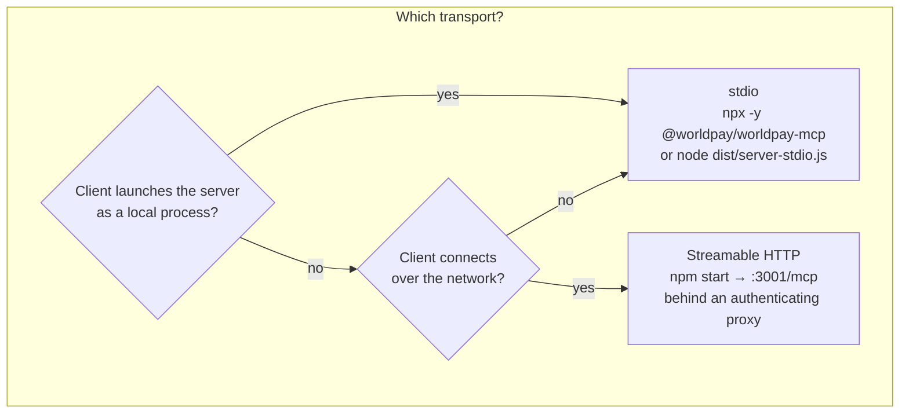
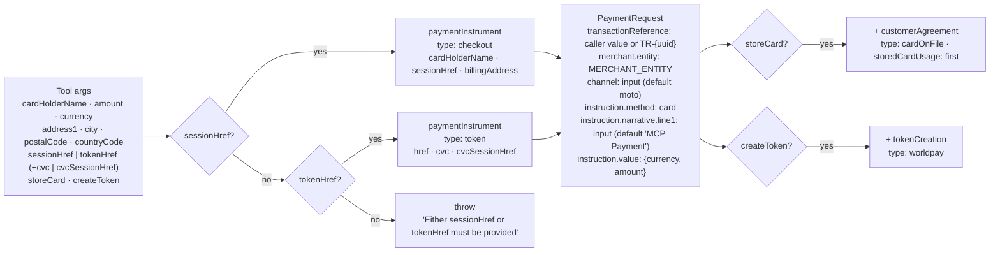

# Architecture

How the Worldpay MCP Server is put together, traced from the code at upstream commit `e674e2a`. Read this before extending it, wrapping it, or deciding how to deploy it.


- [Components](#components)
- [Transports](#transports)
- [Server and tool registration](#server-and-tool-registration)
- [The API client](#the-api-client)
- [Request lifecycle](#request-lifecycle)
- [Error model](#error-model)
- [Logging](#logging)
- [Configuration](#configuration)
- [Build and packaging](#build-and-packaging)
- [Design properties worth knowing](#design-properties-worth-knowing)

---

## Components


| Layer | Files | Responsibility |
|---|---|---|
| **Entrypoints** | `src/server-stdio.ts`, `src/server-http.ts` | Load + validate config (`src/config.ts`), construct `WorldpayMCPServer`, connect a transport |
| **Transports** | `src/transports/StdioTransport.ts`, `HTTPTransport.ts`, `ServerTransport.ts` | Move JSON-RPC between client and server |
| **Server** | `src/worldpay-mcp-server.ts` | Extend the SDK's `McpServer`; own one `WorldpayAPI`; register the tools |
| **Tools** | `src/tools/mcp-tool.ts` + `src/tools/{hpp,payments,payouts,sessions}/*.ts` | One class per tool: name, title, description, Zod shape, `execute()` |
| **Schemas** | `src/schemas/schemas.ts` | Eight Zod objects shared by the nine tools (the two payment tools share `paymentSchema`) |
| **API client** | `src/api/worldpay.ts` | Build Worldpay requests, attach Basic auth, `fetch`, raise on non-success |
| **Types** | `src/types/*.d.ts` | Generated typings for Worldpay's Payments, Payment Pages, Queries, Payouts and Sessions APIs |
| **Utilities** | `src/utils/logger.ts`, `src/utils/mcp-response.ts` | Winston file logger; `ToolCallResponse` / `ToolCallResponseError` wrappers |

---

## Transports

### stdio — `src/server-stdio.ts`

The default. The package's `bin` points here, the Docker image's `CMD` runs it, and every desktop MCP client launches it as a child process. `StdioTransport` wraps the SDK's `StdioServerTransport` and calls `server.connect()`. The process reads JSON-RPC from stdin and writes it to stdout; **nothing else may be written to stdout**, which is why the logger writes to a file and not the console.

### Streamable HTTP — `src/server-http.ts` → `src/transports/HTTPTransport.ts`

An Express 5 app on port **3001** (`PORT`), bound to **127.0.0.1** by default (`HOST`), exposing:

| Route | Purpose |
|---|---|
| `POST /mcp` | JSON-RPC requests. **Requires `Authorization: Bearer <MCP_AUTH_TOKEN>`** (401 otherwise). A request without an `Mcp-Session-Id` header starts a new session with a fresh `WorldpayMCPServer` instance and a secure random id; subsequent requests carry the header |
| `GET /mcp` | Server-to-client event stream for an existing session |
| `DELETE /mcp` | Ends a session |
| `GET /healthz` | `{"status":"up"}` — liveness |
| `GET /readyz` | `{"status":"ready"}` — readiness (no dependency check; always ready once listening) |

Response hardening middleware sets a locked-down `Content-Security-Policy` (`default-src 'none'` …), `X-Content-Type-Options: nosniff`, `X-Frame-Options: DENY`, `X-XSS-Protection: 1; mode=block`, `Referrer-Policy: no-referrer`, and disables `x-powered-by`. **DNS-rebinding protection** validates the `Host` header against an allowlist (the bind host plus `MCP_ALLOWED_HOSTS`); a spoofed `Host` is rejected with 403. CORS is **same-origin by default** — cross-origin is allowed only for an explicit `CORS_ORIGIN` allowlist, never `*` with credentials.

**A fresh `WorldpayMCPServer` is created per session** (never a shared instance), so concurrent sessions work. Sessions live in an in-memory `Map`, keyed by a secure random id, capped at `MCP_MAX_SESSIONS` (default 100) and evicted after `MCP_SESSION_TTL_MS` idle (default 30 min) or on `onclose`. **Authentication is by bearer token, independent of the session id** (per the MCP security spec, sessions are never used for auth). The server refuses to start the HTTP transport if `MCP_AUTH_TOKEN` is unset.



---

## Server and tool registration

`WorldpayMCPServer` (`src/worldpay-mcp-server.ts`) extends `McpServer`. Its constructor passes `{name, version}` to the SDK, builds a single `WorldpayAPI` from the config, then instantiates the nine tool classes and loops:

```ts
tools.forEach(tool => {
  this.registerTool(tool.getName(), tool.getDefinition(), (args, extra) => tool.execute(args));
});
```

`getDefinition()` returns `{title, description, inputSchema}` where `inputSchema` is the Zod object's `.shape`. The SDK turns that into JSON Schema for `tools/list` and validates incoming `tools/call` arguments against it — so a call with a missing required field or wrong type never reaches `execute()`.

Two consequences of this shape:

- **The `extra` argument is not used.** Request metadata the SDK offers (progress token, abort signal) is discarded at the dispatch closure, so tools can't be cancelled mid-flight. Inbound authentication is handled at the HTTP transport (bearer token), not per tool.
- **Annotations are set.** Every tool declares `readOnlyHint` / `destructiveHint` / `idempotentHint` / `openWorldHint` via `getDefinition()`, so `tools/list` lets a client tell the read-only `query_*` tools from the money-moving ones — see [security.md](security.md#tool-approval-policy).

Server identity as seen by clients on `initialize`: `{ name: "Worldpay", version: "1.2.0" }` (read from `package.json` via `src/config.ts`). Capabilities: `tools` only.

---

## The API client

`WorldpayAPI` (`src/api/worldpay.ts`) is a thin wrapper over the global `fetch`. Each method builds one request:

| Method | Call | Headers of note | Success |
|---|---|---|---|
| `takeGuestPayment` | `POST {WORLDPAY_URL}/api/payments` | `Content-Type: application/json`, `WP-Api-Version: 2024-06-01` | 201 or 202 |
| `managePayment` | `POST {commandHref}` (the HAL action link from a prior payment response) | `Content-Type: application/json`, `WP-Api-Version: 2024-06-01`; no body | 201 or 202 |
| `callQueryAPI` / `callQueryAPIWithParams` | `GET {WORLDPAY_URL}/paymentQueries/payments[?…]` or `/paymentQueries/payments/{id}` | `Accept: application/vnd.worldpay.payment-queries-v1.hal+json` | 200 |
| `queryAccountPayouts` | `GET {WORLDPAY_URL}/paymentQueries/payments?…&entity={MERCHANT_ENTITY}` | as above | 200 |
| `createDelegateToken` | `POST {WORLDPAY_URL}/sessions/agentic_commerce/delegate_payment` | `Content-Type: application/json`, `API-Version: 2025-09-29`, `Accept: application/json` | 201 |

`create_hosted_payment` is the exception: `CreateHPPTransaction` builds and sends its own request (`POST {WORLDPAY_URL}/payment_pages`, `Content-Type`/`Accept: application/vnd.worldpay.payment_pages-v1.hal+json`, success 200) reading `process.env` directly rather than going through `WorldpayAPI` — the two `TODO` comments in that file say it should move.

**Authentication** is HTTP Basic, computed per call from `config.username:config.password`. There is no OAuth, no API-key header, no token refresh.

**Query responses** are lightly unwrapped: if the body has `_embedded`, `callQueryAPI` returns `_embedded.payments` (an array); otherwise it returns the body as-is. Payment and ACP responses are returned untouched.

### Request building for payments

`createRequest()` turns the flat `paymentSchema` arguments into Worldpay's nested Payments API body:



The **channel** (default `moto`), **statement narrative** (default `MCP Payment`) and **transaction reference** (default a generated `TR-<uuid>`) all have sensible defaults but are now optional tool inputs — set `channel` / `narrative` / `transactionReference` when interchange, statements or idempotent retries require it. Also guarded here: supplying **both** `sessionHref` and `tokenHref` is rejected (previously `sessionHref` silently won).

---

## Request lifecycle

The sequence diagram in the [README](../README.md#request-lifecycle) shows `take_guest_payment` end to end. The same shape applies to every tool:

1. Transport delivers `tools/call` to the SDK.
2. SDK validates `arguments` against the tool's Zod shape, applying defaults.
3. `execute(args)` runs inside a `try`.
4. The API method builds the request, logs it, fetches, checks the status code, parses JSON.
5. Success → `new ToolCallResponse(MCPResponse.text(result))`, i.e. `{ content: [{ type: "text", text: JSON.stringify(result) }] }`.
6. Failure → caught; logged at `error`; `new ToolCallResponseError(MCPResponse.text("<Tool> failed: <message>"))`, i.e. the same shape plus `isError: true`.

There is no `structuredContent`, no resource links, and no streaming — one text block per call.

---

## Error model

Errors reach the model as prose inside an `isError` result, built from the thrown `Error.message`. The messages are consistent per tool:

| Tool | Message | When |
|---|---|---|
| `take_guest_payment`, `create_worldpay_token` | `Payment failed: Payment failed with status {code}: {body}` | non-201/202 |
| `manage_payment` | `Payment command failed: Payment failed with status {code}: {body}` | non-201/202 |
| `query_payments_by_date`, `query_payment_by_id`, `query_payments_by_transaction_reference` | `Query failed: Payment Query failed with status {code}: {body}` | non-200 |
| `query_account_payouts` | `Payment failed: Payment Query failed with status {code}: {body}` | non-200, or an unexpected response shape |
| `create_hosted_payment` | `Hosted Payment failed: Hosted payment transaction failed with status {code}: {body}` | non-200 |
| `create_delegate_token` | `Delegate token failed: Creating a Delegate Token failed with status {code}: {body}` | non-201 |
| any tool except `create_hosted_payment` | `{prefix} Username and password required for Basic auth` | credentials missing from env (the eight tools routed through `WorldpayAPI`; `create_hosted_payment` builds auth inline and instead surfaces a Worldpay 401) |
| `take_guest_payment`, `create_worldpay_token` | `Payment failed: Either sessionHref or tokenHref must be provided` | neither instrument supplied |

`{body}` is Worldpay's error JSON, serialised. That is useful — it carries Worldpay's `errorName`, `message` and validation detail — but note that it is passed unfiltered into the model's context. A non-JSON error body (an HTML gateway page, for instance) makes `response.json()` throw, and the resulting `SyntaxError` text becomes the message instead.

The HTTP status is embedded in the string rather than returned as a field, so a client that wants to branch on 401 vs 400 vs 5xx has to parse it.

---

## Logging

`src/utils/logger.ts` configures Winston with one transport: a file named `worldpay-mcp.log` in the **current working directory**, level `info`, format `timestamp` + `prettyPrint`. There is no console transport (correct for stdio) and no rotation or size cap.

What gets logged:

- every outbound request line (`Calling GET …`, `Calling POST …`);
- for `take_guest_payment` / `create_worldpay_token` / `create_hosted_payment`, the **full tool arguments** as JSON;
- the `wp-correlationid` response header on payments (quote this when talking to Worldpay support);
- outcomes and counts on success;
- the full error message, including Worldpay's response body, on failure.

Because the working directory is wherever the MCP client launched the process, the log can land somewhere surprising — your project root under Claude Code, the app's directory under a desktop client. See [troubleshooting.md](troubleshooting.md#where-is-the-log-file) and [security.md](security.md#the-log-file).

---

## Configuration

Read once at start-up in the entrypoints via `process.env` (with `dotenv/config` loaded as a side-effect of importing the logger, so a `.env` in the working directory is honoured):

| Variable | Used by | Notes |
|---|---|---|
| `WORLDPAY_URL` | `WorldpayAPI` (as `baseUrl`), `CreateHPPTransaction` | no trailing slash |
| `WORLDPAY_USERNAME`, `WORLDPAY_PASSWORD` | Basic auth | |
| `MERCHANT_ENTITY` | `merchant.entity` on payments/HPP; `entity` query param on payouts | |
| `CORS_ORIGIN` | `HTTPTransport` only | defaults to `*` |

All four are **validated at start-up** by `src/config.ts` (and `MCP_AUTH_TOKEN` by the HTTP transport); a missing value fails fast with a clear message and a non-zero exit. Optional HTTP/behaviour vars: `MCP_AUTH_TOKEN` (required for HTTP), `HOST`, `PORT`, `CORS_ORIGIN`, `MCP_ALLOWED_HOSTS`, `MCP_MAX_SESSIONS`, `MCP_SESSION_TTL_MS`, `WORLDPAY_TIMEOUT_MS`, `LOG_LEVEL`, `LOG_FILE`.

---

## Build and packaging

- **TypeScript 5.9**, `target`/`module` ES2022, `strict`, `noUnusedLocals`, path alias `@/* → src/*` rewritten at build time by `tsc-alias`. Output in `dist/`, which is what the npm package ships (`files: ["dist/**/*"]`).
- `npm run build` = `tsc --build && tsc-alias`. `npm start` runs the HTTP server; the npm `bin` runs the stdio server.
- **Runtime dependencies:** `@modelcontextprotocol/sdk` 1.30, `express` 5, `winston` 3, `dotenv` 16, `cors` 2, `zod` 4 — all declared directly (`zod` and `cors` are no longer relied on transitively; the unused `node-fetch` was removed; the code uses global `fetch`).
- **Docker:** multi-stage `node:20-alpine` (build stage runs `npm ci` + build; runtime stage installs prod deps only and copies `dist/`), runs as the non-root `node` user, `CMD ["node","dist/server-stdio.js"]`.
- **Tests:** Jest 29 + `ts-jest` + `@fetch-mock/jest`; `testMatch: **/*.test.ts`; path alias mapped from `tsconfig`. `npm test` passes without extra flags (verified on Node 22; CI runs it on 20 and 22).

---

## Design properties worth knowing

Stated neutrally — these are the facts you design around.

| Property | Current behaviour | Implication |
|---|---|---|
| Statelessness | No DB, no cache; HTTP sessions only in memory | Trivial to scale horizontally; sessions don't survive a restart |
| Idempotency | `transactionReference` defaults to a generated UUID and is caller-supplyable | Reuse the same reference to make a retry idempotent; no more millisecond collisions |
| Timeouts / retries | Every call has an `AbortSignal.timeout` (`WORLDPAY_TIMEOUT_MS`, default 30s) and `redirect:"error"` | A slow/redirecting upstream fails fast instead of hanging |
| Rate limiting | None on either side | Put limits in the client or a proxy if agents will loop |
| Response fidelity | Raw Worldpay JSON on success; errors sanitized to status + correlation id | Models see successful bodies incl. `_links`; upstream error bodies are logged server-side, not returned |
| Tool annotations | Set on all 9 tools | Clients can auto-classify read-only vs money-moving tools |
| Pagination | `pageSize` honoured on date, payout **and** transaction-reference queries | Consistent paging across the query tools |
| Versioning | Server reports `1.2.0`, read from `package.json` | The advertised version matches the package |

These are the natural next engineering items for anyone extending the server; they are listed as observations, not as a roadmap.
