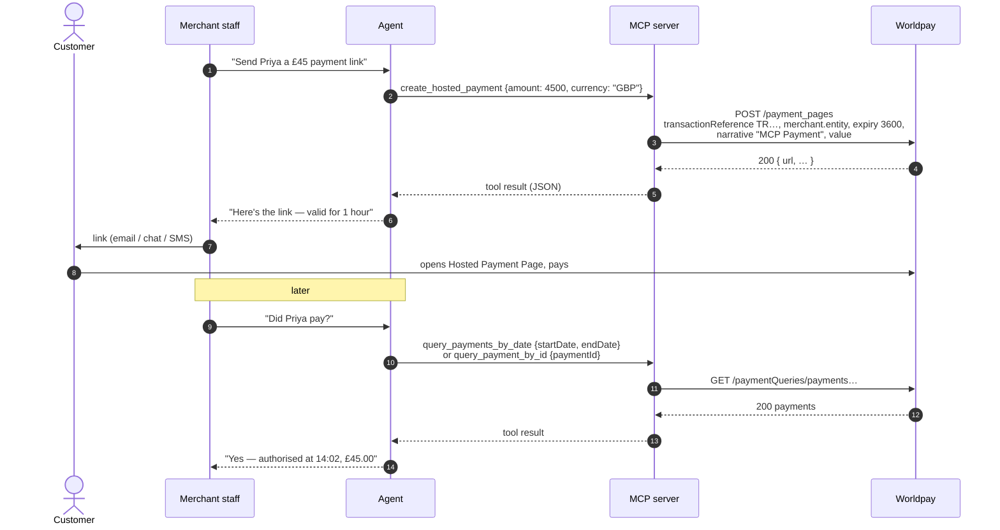
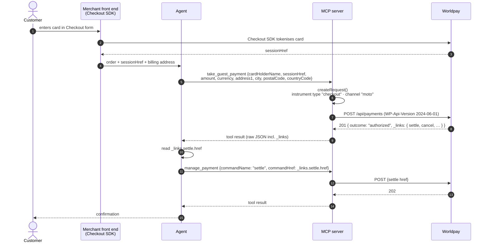
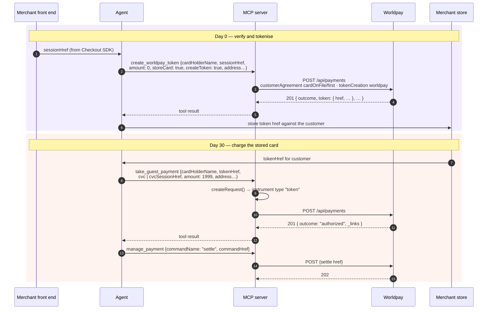
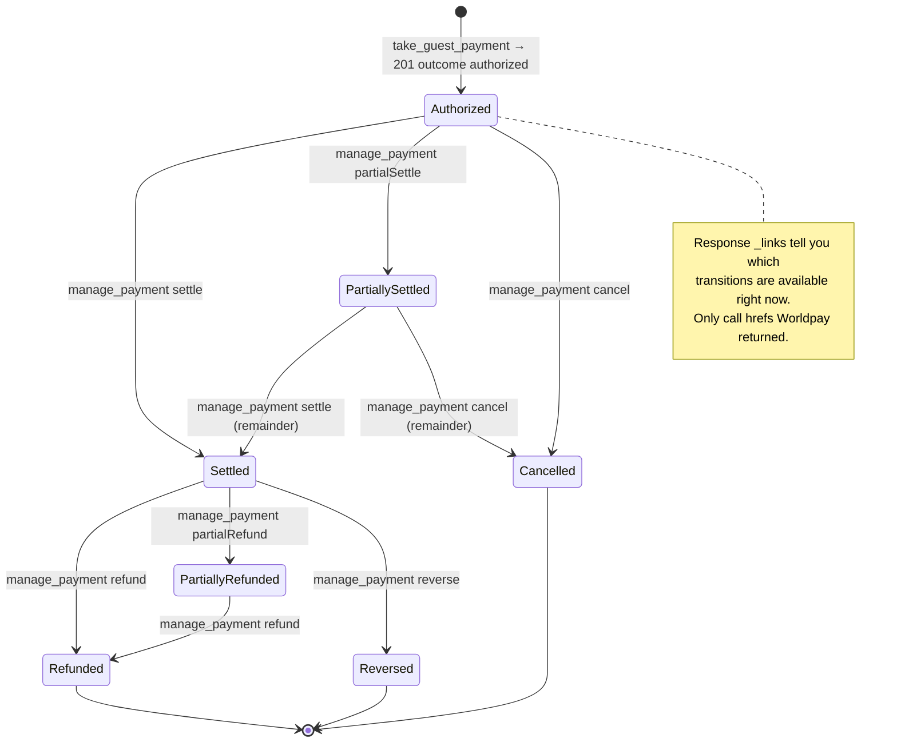
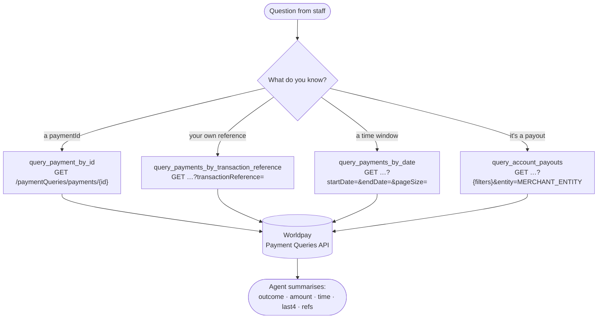
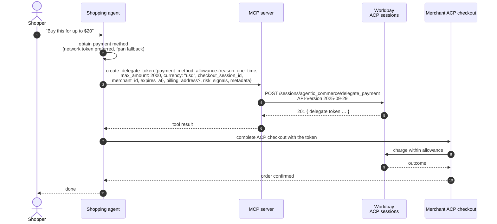

# Business flows

The nine tools are building blocks. This page shows the six merchant scenarios they compose into, as the sequence of calls an AI agent actually makes — with the Worldpay product behind each step and the point at which a human should be in the loop.

| # | Flow | Outcome | Tools |
|---|---|---|---|
| 1 | [Pay by Link](#1-pay-by-link) | Customer pays on a Worldpay-hosted page | `create_hosted_payment`, `query_payment_by_id` |
| 2 | [Guest card payment](#2-guest-card-payment) | Card charged and settled | `take_guest_payment`, `manage_payment` |
| 3 | [Tokenise, then charge later](#3-tokenise-then-charge-later) | Card stored as a token; charged on demand | `create_worldpay_token`, `take_guest_payment` |
| 4 | [Payment lifecycle](#4-payment-lifecycle) | Settle / cancel / refund / reverse | `manage_payment` |
| 5 | [Reconciliation and support](#5-reconciliation-and-support) | Answers from payment and payout history | the four `query_*` tools |
| 6 | [Agentic Commerce](#6-agentic-commerce-acp) | Delegated, spend-limited token for an ACP checkout | `create_delegate_token` |

Conventions in the diagrams: **Agent** is the LLM-driven MCP client; **MCP** is this server; **Worldpay** is Access Worldpay; amounts are in **minor units** (`1000` = £10.00).

---

## 1. Pay by Link

The simplest money-in flow and the only one that needs no card data anywhere near the agent: the agent creates a hosted payment page, a person sends the link, the customer pays on Worldpay's page.

**Product:** [Hosted Payment Pages](https://developer.worldpay.com/products/access/hosted-payment-pages). **Human in the loop:** the member of staff who sends the link; the agent never sees a card. **Fixed by the server:** expiry 3600 s, narrative `MCP Payment`, reference `TR<ms>` — if you need the link to carry an order number, note that the reference is not settable per call today.

---

## 2. Guest card payment

The card is captured by your front end with Worldpay's Checkout SDK, which returns a **session href** — an opaque reference to the card details held by Worldpay. The agent passes that reference; the PAN never enters the model's context.

**Product:** [Payments API](https://developer.worldpay.com/products/access/payments/card-payment) + [Checkout](https://developer.worldpay.com/products/access/checkout/web/card-only). **Human in the loop:** approval of `take_guest_payment` in the client — it moves money. **Note:** every payment is sent with `channel: "moto"` (mail order / telephone order). That is the right channel for an agent taking a payment on a customer's behalf over chat or phone; check it fits your acquiring agreement before using the flow for e-commerce-style transactions.

---

## 3. Tokenise, then charge later

For repeat billing: verify the card once at zero value with `createToken`, keep the returned token href, and charge it later without a new Checkout session. A CVC can be supplied on the later charge either directly or as a CVC session href from the Checkout SDK.

**Product:** [Verified Tokens](https://developer.worldpay.com/products/access/verified-tokens) via the Payments API. **Schema note:** `create_worldpay_token` and `take_guest_payment` share the same input schema; the token tool's description instructs the model to use `amount: 0`, `storeCard: true`, `createToken: true`. `tokenHref` and `sessionHref` are mutually exclusive (enforced at runtime), as are `cvc` and `cvcSessionHref` (stated in the description).

---

## 4. Payment lifecycle

After authorisation, Worldpay's response carries HAL `_links` naming the actions currently available on that payment. `manage_payment` takes one of those links and invokes it. The agent's job is to read `_links` from the previous result and pick the right `href`.

**Product:** [Manage Payments](https://developer.worldpay.com/products/access/payments/openapi/manage-payments). **How the tool works:** `manage_payment {commandName, commandHref}` POSTs to `commandHref` with `WP-Api-Version: 2024-06-01` and **no request body**. `commandName` is informational. Because no body is sent, actions that require an amount — partial settlement or partial refund of a specific value — cannot be expressed through this tool today; full settle, cancel, refund and reverse can. **Human in the loop:** refunds and cancellations are money-moving; require approval.

---

## 5. Reconciliation and support

The four query tools are read-only and make a safe first deployment: a finance or customer-service assistant that can answer "did this go through?", "what did we take on Tuesday?", "where's the payout to this supplier?" without being able to change anything.

**Product:** [Payment Queries](https://developer.worldpay.com/products/access/payment-queries). **Notes:** dates on the payment queries are ISO-8601 date-times (`2026-08-01T00:00:00Z`); on the payout query they are plain dates (`2026-08-01`). `pageSize` is honoured on the date and payout queries (max 499 on payouts). Responses with `_embedded.payments` are unwrapped to the array; a single-payment response is returned whole. Payout results include beneficiary details (IBAN, account number, payee name) — these enter the model's context; see [security.md](security.md#data-that-reaches-the-model).

Suggested client policy: allow the four `query_*` tools without per-call approval; gate everything else.

---

## 6. Agentic Commerce (ACP)

For shopping-agent checkouts built on the Agentic Commerce Protocol, `create_delegate_token` asks Worldpay for a **delegated payment token** bound to an allowance — a maximum amount, a currency, a checkout session and an expiry — that the merchant's ACP checkout can then consume.

**Product:** Access Worldpay's ACP delegate-payment session endpoint. **Schema notes:** ACP field names are `snake_case` (unlike the rest of the server); `allowance.currency` is **lowercase** ISO-4217 (`usd`), `allowance.max_amount` is in minor units; `risk_signals` and `metadata` are required (`metadata` is an empty-object schema). **Card data:** `payment_method.card_number_type` may be `fpan`, in which case `payment_method.number` is a full card number and `cvc` may be present — both pass through the agent's context before reaching Worldpay. Prefer `network_token`, and read [security.md](security.md#card-data-and-pci-scope) before enabling this tool in a production agent.

---

## Choosing a first flow

| If you want to… | Start with |
|---|---|
| Prove the integration with zero risk | **Flow 5** — read-only queries against the sandbox |
| Let an agent take money with no card in context | **Flow 1** (pay by link), then **Flow 2** (Checkout session) |
| Build repeat billing | **Flow 3** on top of Flow 2 |
| Give an ops team an assistant | **Flow 4** + **Flow 5**, with approvals on `manage_payment` |
| Experiment with agentic checkout | **Flow 6**, sandbox only, network tokens only |
