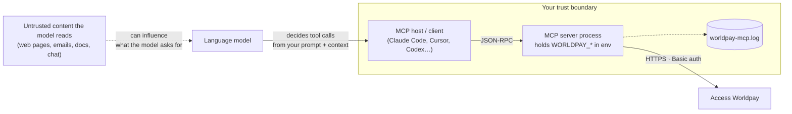

# Security

What you are trusting, what the server does with it, and how to deploy it so that an AI agent holding payment tools is a controlled thing rather than a worrying one. Written from the code; nothing here is a promise about Worldpay's platform.

- [Threat model in one picture](#threat-model-in-one-picture)
- [Credentials](#credentials)
- [Choosing a transport](#choosing-a-transport)
- [Tool approval policy](#tool-approval-policy)
- [Card data and PCI scope](#card-data-and-pci-scope)
- [Data that reaches the model](#data-that-reaches-the-model)
- [The log file](#the-log-file)
- [Operational notes](#operational-notes)
- [Reporting a vulnerability](#reporting-a-vulnerability)

---

## Threat model in one picture

Three things follow:

1. **The model is the caller.** Anything that shapes the model's decisions — including text it reads from untrusted sources — can shape which tools it calls with which arguments. Approval gates on money-moving tools are the control.
2. **The server process is the credential holder.** Whoever can start the process, read its environment, or reach its transport can act as your Worldpay API user.
3. **The log is a record of requests.** It is inside the boundary and must be protected like the environment.

---

## Credentials

- The server authenticates to Worldpay with **HTTP Basic** using `WORLDPAY_USERNAME` / `WORLDPAY_PASSWORD` on every request. That is the full extent of the auth design — no OAuth, no scoped tokens, no rotation logic.
- Credentials live **only in environment variables** (or a `.env` file the process loads from its working directory). They are never written to disk by the server and never returned in a tool result.
- **Use the sandbox while building.** `WORLDPAY_URL=https://try.access.worldpay.com` with sandbox credentials means a runaway agent can't move real money.
- **Least privilege at the source.** Create an API user in the Worldpay Dashboard for the agent with only the products it needs. If it will only query, don't give it a user that can take payments.
- **Don't commit `.env`.** It's in `.gitignore`; keep it that way. For project-scoped client config (`.mcp.json`, `.cursor/mcp.json`) reference environment variables rather than pasting secrets — see the [integration guides](integrations/claude-code.md).
- The hosted-payment tool reads `process.env` directly rather than the injected config; both paths use the same variables, so there is nothing extra to configure, but it means the variables must be present in the **process** environment, not only passed to a constructor if you embed the server.

---

## Choosing a transport

| | stdio | Streamable HTTP |
|---|---|---|
| How the client reaches it | Launches it as a child process; talks over stdin/stdout | Connects to `http://host:3001/mcp` |
| Who can call it | Only the process that spawned it | Anything that can reach the port |
| Built-in caller authentication | Not needed — inherits the launching user's session | **None.** The HTTP transport hardens its *responses* (strict CSP, `nosniff`, `X-Frame-Options: DENY`, `no-referrer`, no `x-powered-by`) but does not authenticate *requests* |
| Sessions | n/a | In-memory `Mcp-Session-Id` map, no TTL |
| Recommended for | Local assistants — Claude Code, Claude Desktop, Cursor, Codex | Shared/remote deployment **behind a reverse proxy that authenticates** (mTLS, OAuth, a signed header from your gateway) and on a private network |

**Default to stdio.** It is the only configuration in which "who can call the server" is answered by the operating system rather than by something you have to build. If you do run HTTP, bind it to a private interface, put authentication in front of it, set `CORS_ORIGIN` to the exact origin of your client, and monitor `/healthz`.

---

## Tool approval policy

The server does not set MCP tool annotations, so your client sees nine identical-looking tools. Set approval by name:

| Always require a human to approve | Safe to allow without a prompt (read-only) |
|---|---|
| `take_guest_payment` — moves money | `query_payments_by_date` |
| `manage_payment` — settle, cancel, refund, reverse | `query_payment_by_id` |
| `create_worldpay_token` — creates a stored credential | `query_payments_by_transaction_reference` |
| `create_hosted_payment` — creates a payable link with your entity on it | `query_account_payouts` |
| `create_delegate_token` — creates a spend-limited token |  |

How to express that per client is in each [integration guide](integrations/). If you are building an autonomous agent (no human at the keyboard), treat the left column as requiring a deterministic check in *your* code — amount caps, allow-listed entities, a second signal — before the call is made.

---

## Card data and PCI scope

The server is designed so that, for the main flows, **no primary account number ever enters the agent's context**:

- `take_guest_payment` and `create_worldpay_token` take a **`sessionHref`** (Worldpay's Checkout SDK tokenised the card in the browser) or a **`tokenHref`** (a previously created Worldpay token). The agent handles references, not card numbers. A CVC can be supplied as `cvcSessionHref` for the same reason — prefer it over the raw `cvc` field.
- `create_hosted_payment` moves the entire card interaction onto Worldpay's hosted page.
- The four `query_*` tools return Worldpay's masked representations.

**The exception is `create_delegate_token`.** Its ACP schema allows `payment_method.card_number_type: "fpan"` with `number` as a full card number and an optional `cvc`. When used that way, the PAN and CVC are **produced by the model as tool arguments**, which means they transit the model's context window and the client's conversation log, and are then forwarded by the server unchanged. Before enabling this tool outside a sandbox:

- prefer `card_number_type: "network_token"` (with `cryptogram` / `eci_value`) so the value in context is a network token, not a PAN;
- confirm with whoever owns your PCI DSS scope that the agent, client and their logs are inside it if `fpan` is ever used;
- check what your MCP client persists (conversation history, telemetry) — that is where an fpan would end up.

---

## Data that reaches the model

Tool results are Worldpay's responses **verbatim**. Expect the model — and therefore your client's transcript — to see:

| Tool | Data in the result |
|---|---|
| payments / token | outcome, masked card (`last4`, brand, expiry), `transactionReference`, issuer auth code, risk factors, HAL `_links` |
| `query_*` payments | as above, per payment |
| `query_account_payouts` | payee name, **IBAN / account number / SWIFT-BIC**, bank name, amounts, state, references |
| `create_delegate_token` | the delegate token and its allowance |
| any failure | Worldpay's error body, including validation messages |

If your client stores conversations (most do), it now stores this. Decide retention for that store as you would for a payments log.

---

## The log file

`worldpay-mcp.log` is written in the server's **working directory** (wherever the client launched it) at `info` level with no rotation. It contains every outbound request line, the **full tool arguments** for `take_guest_payment`, `create_worldpay_token` and `create_hosted_payment` (cardholder name, billing address, hrefs, and `cvc` if you supplied one directly), correlation IDs, and complete error bodies.

Treat it as sensitive data:

- know where it lands for each client (see [troubleshooting](troubleshooting.md#where-is-the-log-file));
- rotate or truncate it — there is no size cap;
- exclude it from backups, sync folders and anything that ships logs to a third party;
- don't paste it into a ticket without redacting.

It is covered by `.gitignore` (`*.log`), so it won't be committed by accident, but it will happily sit in your repository directory.

---

## Operational notes

Properties of the current implementation that matter when an agent — rather than a person — is the caller:

- **No idempotency key.** Each payment call generates `transactionReference: TR<millisecond timestamp>`. If a call times out after Worldpay accepted it, a retry is a *second* payment with a new reference. Build retry logic with a query first, or not at all.
- **No timeouts.** A call waits as long as the upstream does. Set a tool-call timeout in the client.
- **No rate limiting** on either side of the server. An agent in a loop can issue requests as fast as the client allows; cap it in the client or proxy.
- **No cancellation.** The request's abort signal is not wired to the outbound fetch.
- **Errors carry upstream bodies.** Useful for debugging; also means an error result can contain whatever Worldpay returned.

None of these are exotic — they are the normal list for a first-release integration server — but they shape what "safe to automate" means here: read-only first, approvals on writes, sandbox until proven.

---

## Reporting a vulnerability

Worldpay runs a [HackerOne programme](https://hackerone.com/worldpay); [`SECURITY.md`](../SECURITY.md) directs reports there. Please use it rather than a public issue for anything that could affect merchants.
