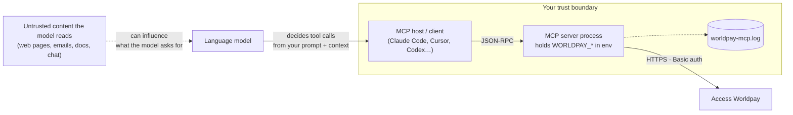

# Security

What you are trusting, what the server does with it, and how to deploy it so that an AI agent holding payment tools is a controlled thing rather than a worrying one. Written from the code; nothing here is a promise about Worldpay's platform.

- [Threat model in one picture](#threat-model-in-one-picture)
- [Credentials](#credentials)
- [Choosing a transport](#choosing-a-transport)
- [Tool approval policy](#tool-approval-policy)
- [Card data and PCI scope](#card-data-and-pci-scope)
- [Data that reaches the model](#data-that-reaches-the-model)
- [The log file](#the-log-file)
- [Operational notes](#operational-notes)
- [Reporting a vulnerability](#reporting-a-vulnerability)

---

## Threat model in one picture

Three things follow:

1. **The model is the caller.** Anything that shapes the model's decisions — including text it reads from untrusted sources — can shape which tools it calls with which arguments. Approval gates on money-moving tools are the control.
2. **The server process is the credential holder.** Whoever can start the process, read its environment, or reach its transport can act as your Worldpay API user.
3. **The log is a record of requests.** It is inside the boundary and must be protected like the environment.

---

## Credentials

- The server authenticates to Worldpay with **HTTP Basic** using `WORLDPAY_USERNAME` / `WORLDPAY_PASSWORD` on every request. That is the full extent of the auth design — no OAuth, no scoped tokens, no rotation logic.
- Credentials live **only in environment variables** (or a `.env` file the process loads from its working directory). They are never written to disk by the server and never returned in a tool result.
- **Use the sandbox while building.** `WORLDPAY_URL=https://try.access.worldpay.com` with sandbox credentials means a runaway agent can't move real money.
- **Least privilege at the source.** Create an API user in the Worldpay Dashboard for the agent with only the products it needs. If it will only query, don't give it a user that can take payments.
- **Don't commit `.env`.** It's in `.gitignore`; keep it that way. For project-scoped client config (`.mcp.json`, `.cursor/mcp.json`) reference environment variables rather than pasting secrets — see the [integration guides](integrations/claude-code.md).
- The hosted-payment tool reads `process.env` directly rather than the injected config; both paths use the same variables, so there is nothing extra to configure, but it means the variables must be present in the **process** environment, not only passed to a constructor if you embed the server.

---

## Choosing a transport

| | stdio | Streamable HTTP |
|---|---|---|
| How the client reaches it | Launches it as a child process; talks over stdin/stdout | Connects to `http://host:3001/mcp` |
| Who can call it | Only the process that spawned it | Anything that can reach the port |
| Built-in caller authentication | Not needed — inherits the launching user's session | **Bearer token required** (`MCP_AUTH_TOKEN`); the server refuses to start without it, and `/mcp` returns 401 without a valid token. Responses are also hardened (strict CSP, `nosniff`, `X-Frame-Options: DENY`, `no-referrer`, no `x-powered-by`) |
| Sessions | n/a | Secure random `Mcp-Session-Id` per session, a fresh server instance each; concurrent sessions supported, capped (`MCP_MAX_SESSIONS`) and idle-expired (`MCP_SESSION_TTL_MS`) |
| Recommended for | Local assistants — Claude Code, Claude Desktop, Cursor, Codex | Remote/shared clients, on a private network and **behind a proxy** for defence in depth (the built-in bearer token is the minimum, not the whole story) |

**Default to stdio** for local single-client use — "who can call the server" is answered by the operating system. For HTTP: set a strong random `MCP_AUTH_TOKEN`, keep the default `127.0.0.1` bind (or put a proxy in front for remote access), set `CORS_ORIGIN` to your client's exact origin only if a browser calls it, and monitor `/healthz`. DNS-rebinding protection is on by default.

---

## Tool approval policy

All nine tools declare MCP annotations, so a client can auto-classify read-only vs money-moving tools. Still, set explicit approval by name — the annotations are a hint, not an enforcement:

| Always require a human to approve | Safe to allow without a prompt (read-only) |
|---|---|
| `take_guest_payment` — moves money | `query_payments_by_date` |
| `manage_payment` — settle, cancel, refund, reverse | `query_payment_by_id` |
| `create_worldpay_token` — creates a stored credential | `query_payments_by_transaction_reference` |
| `create_hosted_payment` — creates a payable link with your entity on it | `query_account_payouts` |
| `create_delegate_token` — creates a spend-limited token |  |

How to express that per client is in each [integration guide](integrations/). If you are building an autonomous agent (no human at the keyboard), treat the left column as requiring a deterministic check in *your* code — amount caps, allow-listed entities, a second signal — before the call is made.

---

## Card data and PCI scope

The server is designed so that, for the main flows, **no primary account number ever enters the agent's context**:

- `take_guest_payment` and `create_worldpay_token` take a **`sessionHref`** (Worldpay's Checkout SDK tokenised the card in the browser) or a **`tokenHref`** (a previously created Worldpay token). The agent handles references, not card numbers. A CVC can be supplied as `cvcSessionHref` for the same reason — prefer it over the raw `cvc` field.
- `create_hosted_payment` moves the entire card interaction onto Worldpay's hosted page.
- `create_delegate_token` (ACP) accepts **network tokens only** — its schema rejects `card_number_type: "fpan"`, so a raw primary account number cannot be passed as a tool argument and never transits the model context. Supply the network token with its `cryptogram` / `eci_value`.
- The four `query_*` tools return Worldpay's own query responses (card details masked; the payout query, however, returns beneficiary bank details — see below).

No tool accepts a raw PAN. If you later re-introduce one, confirm with whoever owns your PCI DSS scope that the agent, client and their logs are inside it.

---

## Data that reaches the model

Successful tool results are Worldpay's responses **verbatim** (errors are sanitized — see the last row). Expect the model — and therefore your client's transcript — to see:

| Tool | Data in the result |
|---|---|
| payments / token | outcome, masked card (`last4`, brand, expiry), `transactionReference`, issuer auth code, risk factors, HAL `_links` |
| `query_*` payments | as above, per payment |
| `query_account_payouts` | payee name, **IBAN / account number / SWIFT-BIC**, bank name, amounts, state, references |
| `create_delegate_token` | the delegate token and its allowance |
| any failure | a sanitized message: HTTP status + Worldpay correlation id (the full error body is logged server-side, not returned) |

If your client stores conversations (most do), it now stores this. Decide retention for that store as you would for a payments log.

---

## The log file

`worldpay-mcp.log` is written in the server's **working directory** (wherever the client launched it) at `info` level (`LOG_LEVEL` / `LOG_FILE` to change), with no rotation. Sensitive fields are **redacted before writing** — CVC, card `number`, cardholder name, billing address, IBAN/account details and session/token hrefs are masked (`src/utils/redact.ts`), and upstream error bodies are logged server-side but truncated. It still records outbound request lines and correlation ids.

Treat it as sensitive data:

- know where it lands for each client (see [troubleshooting](troubleshooting.md#where-is-the-log-file));
- rotate or truncate it — there is no size cap;
- exclude it from backups, sync folders and anything that ships logs to a third party;
- don't paste it into a ticket without redacting.

It is covered by `.gitignore` (`*.log`), so it won't be committed by accident, but it will happily sit in your repository directory.

---

## Operational notes

Properties of the current implementation that matter when an agent — rather than a person — is the caller:

- **Idempotent retries are possible.** `transactionReference` defaults to a generated UUID but is caller-supplyable — reuse the same value to make a retry idempotent rather than create a second payment.
- **Timeouts are enforced.** Every outbound call has an `AbortSignal.timeout` (`WORLDPAY_TIMEOUT_MS`, default 30s) and refuses redirects; still set a tool-call timeout in the client as a backstop.
- **No rate limiting** on either side of the server. An agent in a loop can issue requests as fast as the client allows; cap it in the client or proxy.
- **Errors are sanitized.** An error result carries the HTTP status and Worldpay correlation id, not the raw upstream body (which is logged server-side).

None of these are exotic — they are the normal list for a first-release integration server — but they shape what "safe to automate" means here: read-only first, approvals on writes, sandbox until proven.

---

## Reporting a vulnerability

Worldpay runs a [HackerOne programme](https://hackerone.com/worldpay); [`SECURITY.md`](../SECURITY.md) directs reports there. Please use it rather than a public issue for anything that could affect merchants.
